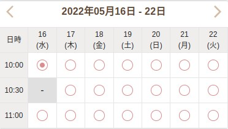

# react-mui-calendar

> The calendar build by react &amp; mui

[](https://www.npmjs.com/package/react-mui-calendar) [](https://standardjs.com)



## Install

```bash
npm install --save @rsdn/react-mui-calendar
```
or yarn
```bash
yarn add @rsdn/react-mui-calendar
```

## Usage

```tsx
import React, { Component } from 'react';

import ReactMuiCalendar from '@rsdn/react-mui-calendar';

export default function YourComponent() {
  const datesDisabled = [
    '2022-05-16 10:30',
    '2022-05-18 14:00',
    '2022-05-18 14:30',
    '2022-05-20 15:00'
  ];

  const times = ['10:00', '10:30', '11:00'];
  
  const [dates, setDates] = useState<string[]>(['2022-05-16 10:00']);

  const handleChange = (datesSelected) => {
    setDates(datesSelected);
  }
  return <ReactMuiCalendar
    datesDisabled={datesDisabled}
    times={times}
    dates={dates}
    change={handleChange}
  />
}
```

## License

MIT © [rs-duongnt1](https://github.com/rs-duongnt1)
